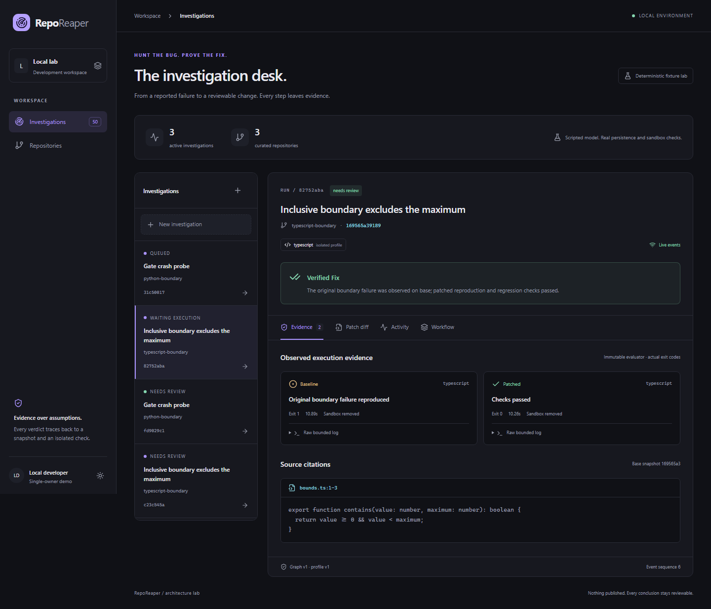

# RepoReaper

Hunt the bug. Prove the fix.

**RepoReaper is an evidence-first repository debugging workbench.** Its goal is to turn a
reported bug into a reproduced failure, a tested candidate fix, and a reviewable patch with
traceable evidence. It is built for developers investigating unfamiliar code and reviewers
who need to understand why a proposed change should work.

The name combines **Repo**, the source repository, with **Reaper**, the removal of defects.
The guiding idea is simple: **hunt the bug, prove the fix**. A run should preserve the source
snapshot, observed failures, test results, verification gaps and patch that support its verdict.

**Current status: M0 architecture foundation validated; development continues.** The current
application runs curated Python and TypeScript boundary fixtures through real PostgreSQL,
Redis/Celery, LangGraph and isolated Docker execution. Its model adapter is deterministic;
this release does not claim to repair arbitrary repositories.

Start here: [Demo](#try-the-current-demo) · [Setup](#reproducible-local-setup) ·
[Architecture](docs/design-overview.md) · [Validation](docs/architecture/gate-report.md) ·
[Roadmap](docs/roadmap.md) · [Contributing](CONTRIBUTING.md).
The complete product and engineering specification is [requirement.md](requirement.md).

## What the current release demonstrates

- An immutable repository snapshot and workspace-scoped run are accepted durably before queue delivery.
- A failing baseline and patched regression harness execute in separate disposable sandboxes.
- The graph checkpoints its exact pending execution and releases the worker while it waits.
- Crashes, duplicate delivery and loss of Redis recover from authoritative PostgreSQL state.
- React shows actual progress, source citations, bounded log downloads, a Monaco diff and patch export.
- Missing verification coverage produces an explicit partial result.

| Capability | Available now | Remaining work |
|---|---|---|
| Python | Syntax adapter; real baseline/patched fixture execution | General project environments and broader fixtures |
| TypeScript | Syntax adapter; Node.js execution and strict TypeScript checks | General project test/build harnesses |
| JavaScript / JSX | Syntax adapter; shared Node runtime foundation | Dedicated executable fixture coverage |
| TSX / mixed Python + React | Both targets detected; mixed diff; Python checks; partial verdict | Actual React profile and complete mixed verification |
| Go / Java | Syntax adapters validated | Runtime profiles and verification in R2 |
| Other source languages | Future bounded text fallback specified | Generic ingestion/chunking in M2 |

Local validation: **17 architecture integration tests**, **9 unit tests** and **2 real browser
tests** passed. The integration gate covers all ten mandatory architecture scenarios, including
process crashes, early completion, broker loss, cancellation, multi-process ownership,
tenant isolation and paused-run upgrades. See the [evidence report](docs/architecture/gate-report.md)
for exact scope, reproduced failures and measured resource usage. CI status is tracked separately.



## Try the current demo

After setup, open [localhost:8080](http://localhost:8080):

1. Choose the Python or TypeScript curated repository and start an investigation.
2. Follow durable activity while baseline and patched checks run in isolated containers.
3. Inspect the recorded baseline failure, patched exit code, source citation and raw log.
4. Open **Patch diff** and export the actual unified patch.
5. Run the mixed fixture to see why missing React verification yields a partial verdict.

The issue form supplies context for the known fixture defect; it does not turn the scripted
adapter into a general coding model. Fixture evidence is clearly labeled in the interface.

## Stack and repository map

Python 3.12 / FastAPI; LangGraph; SQLAlchemy and PostgreSQL; Celery prefork and Redis;
Qdrant; Tree-sitter grammar registry; a private Linux Docker runner; React/TypeScript,
Vite, Tailwind, Radix/shadcn components, Motion, Monaco and React Flow.
Exact compatible versions are in the committed locks and [compatibility ADR](docs/adr/0002-compatibility-spike.md).

| Path | Purpose |
|---|---|
| `apps/api/src/reporeaper` | Public API, contracts, durable graph, delivery/recovery and adapters |
| `apps/runner/src/reporeaper_runner` | Private execution API, shared reservations and sandbox lifecycle |
| `apps/web` | Actual-state React interface and Playwright browser tests |
| `migrations` | Explicit workspace-scoped PostgreSQL schema |
| `fixtures/repositories` | Trusted multi-language demo source snapshots |
| `evaluations/harness` | Immutable checks outside patchable source |
| `infra/containers` | Pinned application, compiler, sandbox and web images |
| `tests/gate`, `tests/unit` | Executable architecture and contract checks |
| `packages/contracts` | OpenAPI contract; generated frontend types live in the web app |
| `docs` | Design, roadmap, decisions, setup evidence, threat model and continuation notes |

## Reproducible local setup

Requires a Linux Docker engine (Docker Desktop/WSL2 on Windows), Python 3.12, uv 0.12.22,
Node 22.20 and pnpm 11.19.0. Dependencies are frozen in `uv.lock`,
`apps/web/pnpm-lock.yaml` and the trusted TypeScript profile's `package-lock.json`.
No paid model credentials are needed for M0. The application's automated PR publication is disabled.

If uv/pnpm are not installed, install the pinned tooling after installing Python and Node:

```powershell
python -m pip install uv==0.12.22
npm install --global pnpm@11.19.0
```

Clone the public project first:

```powershell
git clone https://github.com/vivekbasupya/RepoReaper.git
cd RepoReaper
```

Allow roughly 4 GiB for the Linux Docker engine for this small fixture setup. The measured
reference engine had about 3.5 GiB; the gate report records observed use rather than promising
production capacity. Image/dependency builds require network access, but fixture execution
itself has no network access.

On Windows select the Linux engine: `docker context use desktop-linux`.
From the repository root:

```powershell
uv sync --frozen
uv run python scripts/init_env.py
docker build -f infra/containers/python.Dockerfile -t reporeaper-python:local .
docker build -f infra/containers/node.Dockerfile -t reporeaper-node:local .
uv run python scripts/pin_profiles.py
docker compose --profile runner build api runner web
docker compose up -d postgres redis qdrant
docker compose run --rm migrate
docker compose --profile runner up -d api graph dispatcher runner runner-worker web
```

Open [the local app](http://localhost:8080). Only the web proxy binds to loopback;
database, queue, vector service and runner have no public ports. The local session uses
workspace membership checks. Hosted authentication is a later milestone.

Fixtures/evaluators are baked into immutable profile images. Rebuild profiles, pin digests,
then recreate services after fixture/compiler changes. Accepted runs retain captured
configuration; never change their image identities silently. Schema migration and
LangGraph checkpoint-table setup are explicit deployment steps.

## Real architecture gate

The gate deliberately kills trusted test processes and recreates **only** the named local
Redis container. PostgreSQL and artifact volumes are retained. Use an isolated local deployment;
the one-shot fault probes and daemon access belong to the trusted gate controller.

```powershell
docker compose -f compose.yaml -f compose.gate.yaml --profile runner up -d api graph dispatcher runner runner-worker web
docker compose -f compose.yaml -f compose.gate.yaml --profile test run --rm gate
```

Run the gate after migrations/seed. Select services explicitly so the test container cannot
race migration/startup. Reports are written to `docs/architecture/reports`.
No mocked/skipped gate is a pass. Restore normal services to disable fault probes afterward:

```powershell
docker compose --profile runner up -d api graph dispatcher runner runner-worker web
```

## Other checks

```powershell
uv run ruff check .
uv run pytest tests/unit -q
pnpm --dir apps/web install --frozen-lockfile
pnpm --dir apps/web build
pnpm --dir apps/web exec playwright install chromium --only-shell
pnpm --dir apps/web exec playwright test
```

Browser tests use real API state and execute fixture runs. Chromium needs system
dependencies on Linux (`playwright install --with-deps`). GitHub Actions reproduces
frozen builds, the real gate and browser checks; CI itself is unverified until the workflow
runs on GitHub. No remote push is required for local verification.

## Recovery and limitations

Redis is delivery only. Dispatcher requeues incomplete PostgreSQL commands. Restart
graph/controller processes without deleting data. Never use `down -v` on data to retain.
Follow the stability policy for backups, populated migrations and old graph executables.

The deterministic model repairs a known boundary fixture. Qdrant fixture vectors are
nonsemantic; mixed React execution is deliberately missing in M0 and yields partial
verification. Generic ingestion, full approvals, GitHub integration and the benchmark corpus
remain later work. The curated Docker controller is not a public untrusted-code sandbox.
Its daemon socket is never mounted into API, graph or repository containers.
Generated credentials live only in ignored `.env`; the sample database password
is for local development.

See [troubleshooting](docs/troubleshooting.md), [security reporting](SECURITY.md),
[contribution workflow](CONTRIBUTING.md), and the [release changelog](CHANGELOG.md).

## License

No license has been selected yet, at the project owner's request. There is currently no
`LICENSE` file. Contact [vivekbasupya](https://github.com/vivekbasupya) about reuse or licensing.
