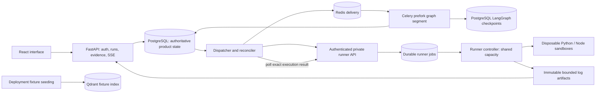

# Design and product meaning

RepoReaper asks two concrete questions: can the reported defect be observed on the original
source, and does the candidate patch pass unchanged checks across every affected target?
Its intended output is an auditable review package: issue context, immutable base SHA,
source citations, reproduction evidence, a bounded patch, test comparison and limitations.

A Python backend does not imply Python-only repositories. Repository languages are independent
capabilities: syntax analysis, retrieval, patch generation and executable verification can
have different coverage. A Python backend plus React frontend is a mixed project; passing
one target's tests cannot establish verification of the whole patch.

## Current working flow

The M0 graph is a deliberately thin deterministic workflow: prepare a stable execution
intent, checkpoint and interrupt, receive its exact result, repeat for patched execution,
then compute an evidence-based outcome. It does not yet implement the complete researcher,
reproducer, patcher and reviewer model workflow described by the specification.

Qdrant receives real workspace/snapshot-filtered fixture queries in the gate. Its eight-value
hash vectors are nonsemantic. Production hybrid retrieval and separately queued CPU indexing
remain M2; they are not implied by a successful fixture query.

## Boundaries that matter

- **API:** async validation, membership checks, durable submission, cancellation, UI reads and SSE.
- **Graph workers:** one scoped async segment inside each Linux prefork child; checkpoint waits
  release the worker. They never import or run repository tests on the host.
- **Dispatcher:** shared PostgreSQL leadership, durable outbox reconciliation and bounded
  transport work. Redis is a delivery mechanism, not the source of truth.
- **Runner:** authenticated typed jobs, stable execution IDs, input conflicts, lifecycle and
  shared SQL reservations. Repository processes run only inside disposable containers.
- **Artifacts:** opaque workspace-scoped content keys and bounded evidence; checkpoints carry
  result references rather than raw repository logs.
- **Future index/publisher workers:** CPU parsing and authorized GitHub actions remain separate
  boundaries. Publishing this project's source does not enable the application's PR publisher.

Network/database work uses async clients. Blocking filesystem/publish operations use bounded
threads. CPU work belongs in separate processes. Global capacity uses shared persisted state,
not a semaphore copied into every worker process.

## Durable handoff

1. Accept run, event and outbox command in one PostgreSQL transaction.
2. Acquire graph ownership with lease, fencing token and advisory protection for saver writes.
3. Persist a stable logical execution intent; save the exact waiting checkpoint.
4. Mark dispatchable only after that checkpoint exists, then release ownership.
5. Submit the same execution ID/hash to the private runner; retries return the existing job.
6. Persist the authoritative runner result and log reference before dispatching a resume.
7. Resume only the matching intent/checkpoint under a new valid owner, and consume idempotently.

Recovery tests interrupt the real process between these steps. A delivery timestamp is not
business completion, and an arrived callback is not proof that graph state committed.
See [ADR 0001](adr/0001-durable-boundaries.md) and the detailed
[gate sequence diagram](architecture/gate-report.md).

## Outcome semantics

| Outcome | Meaning in the current slice |
|---|---|
| `verified_fix` | Expected original failure observed; patched checks passed for all available affected targets with no missing profile |
| `partial_verification` | Covered target checks passed but at least one affected target lacks verification |
| `not_reproduced` | The expected original failure was not established |
| `unverified_patch` | A patch exists but the evidence does not establish a verified fix |
| `environment_failure` | Runner/toolchain/timeout infrastructure prevented a trustworthy conclusion |
| `cancelled` | Cancellation persisted and cleanup was reconciled |

Verification is limited to the trusted fixture harness. Full target coverage and an exit code
do not prove all possible inputs are correct. Raw evidence, source/patch/evaluator/image hashes
and explicit missing capabilities keep those limits reviewable.

## Interfaces and evolution

Versioned DTOs define run states, execution requests/results, errors and durable events.
Model, embedding, repository, artifact, language and sandbox integrations have typed boundaries.
Graph v1 remains executable for its paused runs; compiler/profile migrations need their own
compatibility proof. See the [stability plan](architecture/stability-plan.md).

The complete intended behavior is [requirement.md](../requirement.md). The distinction between
validated M0 and unfinished product releases is maintained in [progress](progress.md) and
the [roadmap](roadmap.md).
