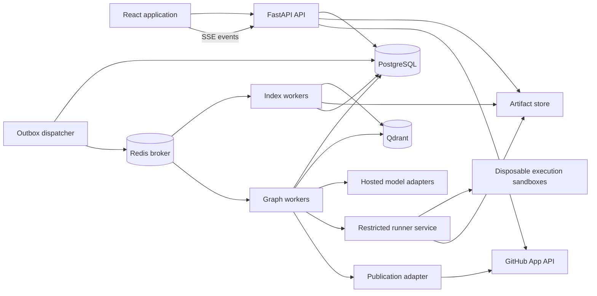

# RepoReaper — Comprehensive Product and Engineering Requirements

Version: 1.2  
Date: 2026-10-02  
Audience: Codex or another implementation agent, and the project owner  
Status: Implementation specification with explicit defaults  
Deliverable: A working full-stack product, reproducible local setup, and evaluated bug-fixing workflow

## 1. Instructions to the implementing agent

Build RepoReaper using this document as the source of truth. Implement the product in phases, including frontend, backend, persistence, retrieval, isolated execution, evaluation, and documentation. Do not stop after building a dashboard or a chatbot.

- Inspect existing code and applicable repository instructions before changing files.
- Respect established implementation where it meets these requirements; avoid unnecessary rewrites.
- Make routine technical decisions autonomously and record significant trade-offs in architecture decision records (ADRs).
- Ask only for information that truly blocks implementation, such as unavailable credentials. Use explicit demo adapters for missing external services and clearly label demo results.
- Implement real vertical slices early. Mock data is acceptable for deterministic demo mode, never as undisclosed production behavior.
- Use current compatible package versions, lock dependencies, and verify integrations in a small spike before broad implementation. Do not blindly copy outdated framework APIs.
- Do not publish a website, send communications, create external PRs, or incur paid service charges merely because this specification describes those runtime features. Implement those features; activation requires appropriate user configuration and authorization.
- Keep a progress checklist and document completed checks and remaining limitations.
- Run meaningful tests for security, concurrency, graph recovery, retrieval, patching, and execution boundaries.
- Never describe a patch as a proven fix solely because an LLM says it is correct.
- Complete the architecture validation gate in section 21 before broad feature implementation. The goal is to discover incompatible workflow/runtime assumptions early, while changes are small.

### Non-negotiable priorities

1. Python API remains responsive while multiple investigations and indexing jobs execute.
2. Untrusted repository code runs only in an execution sandbox.
3. Every investigation is bound to an immutable repository snapshot and has its own writable workspace.
4. Results distinguish observed evidence, proposed hypotheses, reproduced failures, and verified behavior.
5. Changes are reviewable; external publication requires explicit approval bound to the exact patch.
6. React frontend has a distinctive, polished visual design and complete loading/error/empty states.
7. Durable job state and recoverability are real, not held only in process memory.
8. Python is the implementation language of the backend, not a restriction on analyzed repositories. Multi-language and mixed-language repositories are first-class product inputs.

## 2. Product definition

**Name:** RepoReaper  
**Tagline:** Hunt the bug. Prove the fix.

RepoReaper investigates a reported bug in a supported single-language or mixed-language repository, retrieves relevant code and documentation, attempts to reproduce the failure, proposes a minimal patch, verifies it in an isolated environment, and presents an evidence-backed review package. Its backend is implemented in Python; the target repository does not have to be Python. After approval it can create a draft GitHub pull request.

The first version responds to supplied issues. Proactive scheduled bug hunting is an extension, not an implied capability of the initial release.

### Target users

- Developers investigating unfamiliar repositories.
- Engineering teams triaging repetitive maintenance issues.
- Maintainers who need patch suggestions with reproducible evidence.
- Portfolio reviewers evaluating the project's agent engineering and reliability.

### Primary success scenario

1. User selects an authorized repository and immutable commit.
2. User submits a bug description, optional stack trace, and expected behavior.
3. RepoReaper indexes or reuses the correct snapshot.
4. Investigator retrieves relevant functions, tests, and documentation.
5. Reproducer establishes a failing case or explicitly reports inability to reproduce.
6. Patcher generates a constrained code change.
7. Verifier evaluates the reproduction and relevant existing tests.
8. Reviewer summarizes evidence, patch scope, remaining risk, and verification limitations.
9. User examines the diff and downloads a patch or approves a draft PR.

### Release boundaries

| Release | Included |
|---|---|
| R0: foundation | Seeded multi-language repositories, language/capability registry, deterministic demo mode, ingestion, indexing, real UI and API |
| R1: usable MVP | Python and JavaScript/TypeScript issue-to-patch workflows, mixed Python+React fixture, isolated tests, review, export, cancel/retry, persisted state |
| R2: portfolio release | Go and Java execution profiles, GitHub App, approved draft PRs, per-language benchmark report, concurrency/security validation, operational documentation |
| Later | Languages beyond the baseline matrix, scheduled investigations, stronger public sandbox provider, richer semantic dependency analysis |

Support small-to-medium repositories within the language/capability matrix below that can run under declared Linux execution profiles. Analyze mixed-language repositories without rejecting them because their primary language is not Python. Do not promise fixes for every repository, runtime, dependency environment or issue.

### Language support and capability matrix

Repository analysis, patch suggestion and executable verification are separate capabilities. Report capability per project target, not as one ambiguous “supported” badge.

| Target language | Analysis and patch support | Reproduction/verification profile | Required milestone |
|---|---|---|---|
| Python | Syntax-aware chunks, symbols, exact/semantic search, patch suggestions | Approved Python image and project-declared pytest/unittest harness | R1 |
| JavaScript / JSX | Syntax-aware chunks, symbols, search, patch suggestions | Approved Node.js image, declared package manager, Jest/Vitest or Node test harness | R1 |
| TypeScript / TSX | Syntax-aware chunks, symbols, search, patch suggestions | Approved Node.js image, TypeScript checks, Jest/Vitest where configured | R1 |
| Go | Syntax-aware chunks, symbols, search, patch suggestions | Approved Go toolchain image, go test and selected build checks | R2 |
| Java | Syntax-aware chunks, symbols, search, patch suggestions | Approved JDK image, declared Maven/Gradle wrapper and configured test harness | R2 |
| Other text-based source languages | Bounded text search and generic chunk fallback; best-effort unverified suggestions | No executable verification unless an explicit tested profile is installed | Fallback in R1 |

HTML, CSS, JSON, YAML, SQL, shell scripts and Markdown may provide essential context and be included in a constrained patch. Their presence does not automatically grant permission to execute scripts or claim runtime verification.

Do not label fallback text analysis as full semantic understanding. A repository can have full support for one target and partial support for another. The UI must surface unsupported targets, missing toolchains and exact verification coverage.

### Mixed-language and monorepo behavior

- Detect per-file languages and per-package build targets using manifests such as pyproject.toml, package.json, go.mod, pom.xml and Gradle files. Repository-wide “primary language” is only a display hint.
- Analyze Python+React, Node+TypeScript, and mixed backend/frontend layouts. Resolve package roots, toolchain versions and declared dependency relationships.
- Let retrieval span language boundaries when authorized within the same snapshot. For example, connect a frontend request shape to a backend validation error using evidence from both.
- Select an explicit execution plan for affected targets and relevant dependency checks. Never execute every discovered package script automatically.
- A patch spanning Python and TypeScript must run the required profiles for both, including a curated integration check where the issue crosses their boundary.
- If a required affected target cannot be verified, keep the result partial or unverified. Passing Python tests alone cannot verify a frontend/backend fix.
- Keep shared immutable source snapshots but separate writable run/attempt workspaces. Profiles operating on the same patched tree execute sequentially unless isolated immutable copies eliminate mutation races.

## 3. Technology stack

| Layer | Required default | Responsibilities |
|---|---|---|
| Frontend | React, TypeScript, Vite | Application UI and typed API client |
| Design system | shadcn/ui with Radix-based accessible primitives, Tailwind CSS | Owned components, styling, consistent interactions |
| Animation | Motion for React | Restrained page transitions, workflow progress, micro-interactions |
| Icons | Lucide React | Consistent iconography |
| Code review | Monaco Editor | Read-only code and diff views; lazy-loaded |
| Workflow visualization | React Flow | Read-only agent graph with status and evidence links |
| Frontend server state | TanStack Query | Fetching, invalidation, request cancellation, cache management |
| Frontend local state | Zustand only where needed | Workspace layout and transient interface state |
| Forms | React Hook Form + Zod | Form validation; generated API types remain authoritative |
| Backend | Python 3.12 baseline, FastAPI, Uvicorn | Async API, auth, SSE, orchestration endpoints |
| Validation/config | Pydantic, pydantic-settings | Typed contracts and validated environment configuration |
| Graph | LangGraph | Controlled agent workflow, checkpoints, interrupts |
| Model integration | Focused LangChain packages | Provider adapters, typed tools, structured output |
| Database | PostgreSQL, SQLAlchemy 2, asyncpg, Alembic | Product state and migrations |
| Checkpoints | LangGraph PostgreSQL saver | Graph persistence in dedicated schema/tables |
| Vector search | Qdrant | Dense/sparse retrieval with strict metadata filtering |
| Code understanding | Tree-sitter language grammar registry for Python, JavaScript/JSX, TypeScript/TSX, Go and Java; ripgrep; optional language-specific analyzers | Structure-aware chunks, exact search, symbol metadata; Python AST only within Python adapter |
| Jobs | Celery prefork workers + Redis broker | Durable delivery, separate indexing and investigation queues |
| Artifacts | S3-compatible object-store interface; filesystem adapter locally | Patches, snapshots, bounded logs and evidence |
| Runner | Dedicated Linux runner; hardened disposable Docker sandbox for curated demo | Reproduction, patch application, test execution |
| Observability | LangSmith optionally enabled, structured JSON logs, metrics endpoint | Traces, operational health, cost and failure analysis |
| Backend quality | pytest, pytest-asyncio, Ruff, mypy | Tests, linting, type checks |
| Frontend quality | Vitest, Testing Library, Playwright | Interaction, accessibility and end-to-end tests |
| Packaging | uv and pnpm lockfiles | Repeatable installations |
| Delivery | Docker Compose locally, GitHub Actions | Service orchestration and CI |

Use a provider-neutral hosted coding model and embedding adapter. Pick actual model IDs through a compatibility spike and benchmark; expose IDs and credentials through configuration. No GPU is required for the baseline. Record embedding dimensions, model version, and normalization rules in index metadata.

Celery and Linux execution workers run in Linux containers or a Linux VM. On Windows develop with Docker Desktop/WSL2; do not rely on native Windows Celery prefork behavior. Document measured resource requirements rather than assuming the user's hardware.

## 4. High-level design (HLD)



### Service boundaries

- **API:** Authorization, validation, durable job submission, UI data, cancellation, approval, event delivery. Never executes repository tests or installs dependencies.
- **Outbox dispatcher:** Publishes committed commands to Redis. At-least-once delivery is expected.
- **Index workers:** Clone/fetch controlled snapshots, validate files, parse code, embed bounded batches, publish index manifests.
- **Graph workers:** Execute bounded graph segments; persist checkpoints, events, artifacts, and transitions.
- **Runner:** Accepts validated execution profiles and artifact references. Owns sandbox lifecycle. Does not accept arbitrary Docker options from agents/users.
- **Publisher:** Holds scoped GitHub credentials outside execution sandboxes. Publishes only an approved patch against a validated base.
- **Cleanup/reconciler:** Reclaims orphaned workspaces, expired leases, abandoned sandboxes, and failed index generations.

Local mode may place services on one development machine, but credentials, networks, containers, and interfaces must still preserve these boundaries. Public mode requires execution infrastructure separated from the application data plane.

### Storage ownership

PostgreSQL is authoritative for product/job state. Qdrant is a derived retrieval index. Redis delivers work and optionally distributes transient notifications; losing Redis must not erase product state. Artifact storage holds large immutable evidence. Do not serialize full source trees, full logs, or credentials into graph state.

## 5. Functional requirements

| ID | Requirement | Required behavior |
|---|---|---|
| FR-01 | Authentication | Local single-user demo identity; GitHub identity and workspace roles for hosted use |
| FR-02 | Repository connection | Approved fixture/local source or authorized GitHub repository; explicit repository permissions |
| FR-03 | Snapshot selection | Resolve branch/ref to immutable SHA and display it throughout investigation |
| FR-04 | Indexing | Background progress, deduplication, exclusions, cancellation, recoverable errors |
| FR-05 | Issue submission | Title, description, expected/actual behavior, stack trace, optional related files |
| FR-06 | Investigation | Evidence-based hypothesis with file and line references tied to snapshot |
| FR-07 | Reproduction | Baseline execution and issue-specific failing case where possible |
| FR-08 | Patch generation | Minimal diff; path restrictions; no silent weakening of tests or security |
| FR-09 | Verification | Before/after reproduction, relevant regression tests, actual exit codes and environment |
| FR-10 | Review package | Diff, evidence, tests, run summary, costs, limitations and outcome |
| FR-11 | Approval | Approve/reject exact patch hash, base SHA and publication destination |
| FR-12 | Patch export | Download unified diff and machine-readable evidence manifest |
| FR-13 | Draft PR | Approved publication, idempotent retry, no automatic merge |
| FR-14 | Control | Cancel, retry as a linked new run, and resume after requested input |
| FR-15 | Live status | Durable event stream, reconnect/replay, bounded logs, honest progress |
| FR-16 | Evaluation | Replay fixed issue corpus and compare retrieval/model/workflow configurations |
| FR-17 | Limits | Per-user/workspace run quotas, provider budgets, bounded queue and execution limits |
| FR-18 | Retention | Configurable artifact/log retention and complete repository-index deletion |

## 6. Python concurrency, processes, and thread management

This is a core architecture requirement. Async tasks, OS threads, worker processes, and execution sandboxes serve different purposes. Do not implement one thread per user or rely on unbounded executors.

### 6.1 Work placement

| Work | Execution strategy | Forbidden placement |
|---|---|---|
| API validation, DB/network I/O, SSE | Async event loop with async clients | Blocking network calls in async routes |
| Small unavoidable blocking I/O | Explicit bounded thread pool / AnyIO capacity limiter | Unlimited per-request threads |
| Parsing, hashing, heavy transformations | Dedicated prefork indexing processes; work sequentially within each CPU task | API event loop or thread-based CPU parallelism assumptions |
| Investigation orchestration and LLM calls | Prefork job process running a scoped async graph segment | FastAPI BackgroundTasks as durable orchestration |
| Git commands and subprocess waiting | Controlled subprocess adapter in worker, with deadline and process-group cleanup | Shell interpolation or API process |
| Repository imports/install/test execution | Dedicated sandbox runner | API/graph worker host Python interpreter |
| Scheduled cleanup | Separate maintenance queue and reconciler | Unmanaged sleeping threads |

For conventional CPython, threads are primarily useful here for blocking I/O; CPU-heavy Python work uses worker processes. Libraries that release the GIL may behave differently, but optimize only after measurement.

### 6.2 API runtime

- Initialize async HTTP clients, DB engine, Redis connection pool and Qdrant client in application lifespan; close them on shutdown.
- Use one SQLAlchemy session per request or independent concurrent task. Never share mutable sessions across tasks.
- Do not call blocking SDK methods, synchronous Git commands, parsing, or test runners directly inside `async def` routes.
- Set explicit connection limits, connect/read deadlines and pool-acquisition timeouts.
- Start long work through persisted job + outbox transaction; return HTTP 202 with run/job ID.
- API processes are stateless regarding durable runs. Scaling Uvicorn workers must not duplicate scheduled work or create independent authoritative job maps.
- Use request cancellation for disposable API work. Closing the browser must not cancel a durable investigation.

### 6.3 Worker runtime

- Use Celery prefork on Linux. Keep graph, CPU indexing, and maintenance queues independently deployable.
- One active graph segment per prefork process by default.
- The synchronous Celery task invokes one `asyncio.run()` entry point per graph segment; construct and close loop-bound async clients/checkpointers inside that entry point.
- Do not reuse async clients or engines across different event loops or initialize connection pools before worker fork.
- Do not call `asyncio.run()` from an already-running event loop.
- Pure synchronous services may be initialized per child process, not shared across forked process boundaries.
- Use structured, bounded concurrency for independent retrieval calls. Patch/reproduce/verify dependencies remain sequential.
- Do not create nested multiprocessing pools inside Celery prefork tasks. Split CPU work into separate queued tasks instead.
- Language adapters must not spawn unbounded parser threads/processes. Java/Node/Go compiler and test parallelism runs inside the sandbox and counts toward the same global resource budget; cap JVM heap, test workers and build parallelism by profile.
- Do not block on Celery child-task `.get()` inside worker tasks; use orchestration/event transitions where cross-queue jobs are necessary.
- Await graph completion for the bounded segment, checkpoint, and return. Human approval and long execution waits must release the worker slot.
- Runner completion resumes a new segment through an idempotent queued command; persist pending tool ID and exact expected result.
- Configure worker prefetch low for long-running work. Late acknowledgment is permitted only with idempotency and tested crash recovery.

### 6.4 Initial tunable capacity profile

The following is a development starting profile, not a throughput guarantee:

```yaml
api_processes: 1
graph_worker_processes: 2
index_worker_processes: 1
maintenance_worker_processes: 1
blocking_io_threads_per_process: 4
retrieval_parallel_calls_per_run: 3
llm_parallel_calls_per_run: 1
global_llm_inflight: 2
embedding_parallel_batches: 1
sandbox_global_slots: 1
active_runs_per_workspace: 2
queued_runs_per_workspace: 10
graph_patch_attempts: 3
run_deadline_seconds: 1800
llm_call_timeout_seconds: 90
sandbox_command_timeout_seconds: 120
```

Expose limits in typed configuration. Account for total threads/processes across all API and worker replicas. Specify database pool budgets per process; their summed maximum must fit the database connection budget.

Process-local semaphores only control one process. Global model, workspace, and runner limits require a shared limiter with expiring reservations, owner IDs and crash cleanup. Use Redis atomic operations for rate control; PostgreSQL leases remain authoritative for run ownership.

### 6.5 Leases, retries, backpressure and cancellation

- Acquire a run lease atomically before changing graph state. Lease includes owner ID, expiration and monotonically increasing fencing token.
- Heartbeat at a bounded interval; state writes validate the current fencing token so a stale worker cannot commit after lease takeover.
- Never hold a DB transaction open across LLM calls or sandbox execution.
- Use optimistic version checks for run updates and unique keys for tool executions/publications.
- Use bounded retries with exponential backoff and jitter only for transient errors. Model rejection, invalid arguments, missing permissions and deterministic test failures are not infrastructure retry cases.
- Define Celery Redis visibility timeout consistently with maximum bounded task duration; test redelivery. Never claim exactly-once delivery.
- Reject excess run creation with an explanatory 429/503 and retry hint; leave permitted work visibly queued.
- Persist cancellation request. Check before/after every expensive operation and at bounded intervals during polling.
- Runner cancellation terminates the entire sandbox/process group and cleans files. Cancelling an asyncio task or thread future alone does not stop its underlying subprocess/thread.
- If thread-offloaded work cannot be killed safely, use finite deadlines and isolate it in a process when stronger cancellation is required.
- On shutdown stop accepting new work, drain short requests, checkpoint bounded segments, release or expire leases, and reconcile abandoned tools on restart.

### 6.6 Required concurrency evidence

Test multiple API processes, duplicate queue delivery, worker death, API restart, cancellation during execution, simultaneous approvals, index reads during new index publication, and model rate limiting. Provide a written resource budget and load-test report. A screen recording of two spinning loaders is not concurrency validation.

## 7. Low-level design (LLD)

Use a modular backend with explicit interfaces. Keep routers thin, services responsible for use cases, repositories responsible for persistence, and adapters responsible for external systems.

### Modules and contracts

| Module/service | Core responsibilities / proposed methods |
|---|---|
| AuthService | Authenticate session, authorize workspace/repository/action |
| RepositoryService | Register source, resolve SHA, create snapshot, delete derived data |
| IndexService | Start generation, parse manifest, embed batches, activate complete generation |
| LanguageRegistry | Detect language; expose parsing, chunking, symbol and patch capabilities; generic fallback |
| ProjectTargetDetector | Discover package roots/manifests, mixed-language targets and declared relationships without executing project code |
| ExecutionPlanService | Select approved runtime profiles and required affected-target checks; report unsupported capabilities |
| RetrievalService | `search(query, scope, limits) -> EvidenceBundle` |
| RunService | `create_run`, `request_cancel`, `retry_run`, state transitions |
| GraphFactory | Compile graph with model/tools/checkpointer and policy context |
| ToolExecutor | Validate typed arguments, scope paths, enforce budget, record execution |
| SandboxClient | `prepare`, `execute`, `status`, `cancel`, `destroy` |
| PatchService | Parse diff, enforce policies, hash artifact, apply against exact base |
| VerificationService | Compare baseline and patched evidence using trusted harness |
| ApprovalService | Bind decision to patch hash/base/action, reject stale decisions |
| PublicationService | Reconcile branch/PR creation, idempotent approved publication |
| EventService | Append durable sequenced events and replay by cursor |
| BudgetService | Reserve model/tool budget, reconcile measured usage |
| RetentionService | Delete orphaned artifacts and retired indexes safely |

Define Pydantic contracts and typing Protocols for ModelAdapter, EmbeddingAdapter, ArtifactStore, RepositoryProvider and SandboxProvider. Do not build a generic plugin framework before the required adapters work.

Implement a small LanguageAdapter interface with detect/parse/chunk/extract_symbols and capability metadata. Keep its registry explicit and versioned; do not assume all syntax nodes or import semantics are identical across languages. ExecutionProfile is a separate contract specifying toolchain/image digest, package root, setup policy, allowed test/build entry points, limits and result parser. Parser support does not imply execution support.

### Graph state

Typed state contains references and small structured values:

```text
run_id, workspace_id, repository_id, snapshot_id, base_sha
issue_id, graph_version, prompt_version, configuration_hash
index_generation_id, retrieval_scope
project_target_ids[], language_capabilities[], execution_plan_id
hypotheses[], evidence_refs[], reproduction_execution_id
patch_attempt, patch_artifact_id, patch_sha256
verification_execution_ids[], verification_outcome
pending_tool_id, pending_approval_id
budget_reserved, usage_measured, cancel_requested
next_action, bounded_error_history[]
```

Treat graph state as internal typed data. UI receives a sanitized projection. Do not expose hidden chain-of-thought; present concise decisions, tool actions and observed evidence.

### Agent roles

1. **Investigator:** Localizes relevant code and produces a testable hypothesis with citations.
2. **Reproducer:** Proposes a reproduction plan within declared execution profiles; deterministic runner executes it.
3. **Patcher:** Produces the smallest plausible code change against a known workspace.
4. **Verifier:** Uses real tool output to assess behavior; cannot fabricate successful tests.
5. **Reviewer:** Checks scope, evidence completeness, policy violations and limitations.

Use a single controlled graph, with role-specific prompts/tools. Agents do not independently contact external systems or mutate shared workspaces. Reviewer disagreement is structured feedback, not an unlimited debate loop.

### Graph branches

```text
validate -> ensure_snapshot_and_index -> retrieve -> investigate
investigate -> request_information OR plan_reproduction
plan_reproduction -> persist_execution_intent -> checkpoint_and_release
checkpoint_confirmed -> dispatcher_submits_execution
execution_completion -> assess_reproduction
assess_reproduction -> baseline_failed OR reproduced OR not_reproduced
reproduced -> propose_patch -> validate_patch -> persist_verification_intent
verification_checkpoint_confirmed -> dispatcher_submits_verification
verification_completion -> assess_verification
assess_verification -> revise_patch (within budget) OR prepare_review
prepare_review -> needs_review
approval -> publish_draft_pr OR export_only OR rejected
any_active_stage -> cancel / infrastructure_failure / budget_exhausted
```

If a failure cannot be reproduced, default to diagnostic output. A user may explicitly request an unverified patch, but it remains labeled unverified and cannot silently become verified through review.

### Run status state machine

Persist lifecycle status separately from technical outcome:

```text
queued -> preparing -> investigating -> waiting_execution
waiting_execution -> investigating OR verifying
investigating -> waiting_input OR verifying OR needs_review
verifying -> waiting_execution OR investigating OR needs_review
waiting_input -> queued (resume command)
needs_review -> completed (export/rejection) OR publishing (approved action)
publishing -> completed OR publication_failed
publication_failed -> publishing (idempotent retry) OR completed (export)
any nonterminal status -> cancelling -> cancelled
any active status -> failed (unrecoverable infrastructure/policy error)
```

Execution and model stages may repeat within bounded attempts. Only RunService applies transitions using version/fence checks. A pending approval is not an active worker. A run awaiting execution releases its graph lease after durable checkpointing; callbacks may resume only the matching pending execution. Terminal runs cannot resume implicitly; retry creates a new linked run. Distinguish rejected publication from a failed fix in the UI.

### Tool API

Allowlist tools such as:

- `semantic_search(query, max_results)`
- `exact_search(pattern, paths, max_results)`
- `read_file(path, start_line, end_line)`
- `lookup_symbol(name)`
- `list_files(prefix, limit)`
- `get_git_diff(base_sha, artifact_id)`
- `submit_reproduction(profile_id, test_artifact_id)`
- `propose_patch(diff)`
- `submit_verification(profile_id, patch_id)`

Derive workspace/repository permissions from trusted run context, not LLM-supplied IDs. Validate relative paths, symlinks, argument sizes, output limits, deadlines and patch scope. Avoid an unrestricted host `run_shell` tool.

## 8. Data model and databases

Use UUID primary keys, UTC timestamps, explicit foreign keys and migrations. Scope all business access to authorized workspace membership. Add indexes for demonstrated access patterns, not every column indiscriminately.

### PostgreSQL tables

| Table | Important fields / constraints |
|---|---|
| users | id, external_identity unique, display_name |
| workspaces | id, name, policy_json, retention_days |
| memberships | workspace_id, user_id, role; unique pair |
| repository_connections | id, workspace_id, provider, external_repo_id, installation_id, permission_status |
| repositories | id, workspace_id, connection_id, name, source_locator, default_ref |
| snapshots | id, repository_id, commit_sha, manifest_artifact_id, status; unique repository+SHA |
| index_generations | id, snapshot_id, embedding_model, dimensions, parser_version, chunker_version, status, collection_name |
| source_files | id, snapshot_id, path, content_hash, language, byte_count; unique snapshot+path |
| project_targets | id, snapshot_id, root_path, languages_json, manifest_path, toolchain_constraints, profile_id nullable, capabilities_json |
| target_dependencies | id, source_target_id, destination_target_id, relationship, evidence_ref; unique declared edge |
| symbols | id, source_file_id, name, kind, start_line, end_line, parent_symbol_id |
| issues | id, repository_id, external_issue_id nullable, title, description, expected_behavior, stack_trace |
| runs | id, workspace_id, issue_id, snapshot_id, index_generation_id, status, outcome, version, lease_owner, lease_until, fence, deadline, cancel_requested, config_hash |
| run_events | id, run_id, sequence, type, schema_version, payload_json, created_at; unique run+sequence |
| tool_executions | id, run_id, logical_step_key, attempt, status, input_hash, output_artifact_id, timing; unique idempotency scope |
| sandbox_executions | id, run_id, tool_id, provider_job_id, profile_id, image_digest, status, exit_code, timeout_flag, artifact_id |
| execution_plans | id, run_id, patch_id nullable, plan_version, required_target_checks_json, unsupported_targets_json, status |
| artifacts | id, workspace_id, run_id nullable, kind, object_key, sha256, size, expires_at |
| patches | id, run_id, attempt, base_sha, artifact_id, sha256, changed_files, policy_result |
| approvals | id, run_id, patch_id, patch_sha256, base_sha, action, decision, actor_id, decided_at; unique logical approval |
| publications | id, approval_id unique, repository_id, branch_name, pr_number, pr_url, status, idempotency_key unique |
| model_usage | id, run_id, model_id, operation_key unique, tokens_in, tokens_out, estimated_cost, actual_cost nullable |
| budget_reservations | id, workspace_id, run_id, operation_key unique, amount, status, expires_at |
| outbox | id, command_type, aggregate_id, dedupe_key unique, payload_json, published_at, attempts |
| command_receipts | command_id unique, run_id, command_type, received_at, accepted_at, completed_at, result_ref; durable consumer acknowledgment |
| execution_intents | id, run_id, logical_step_key, attempt, input_hash, required_checkpoint_id, readiness, execution_id, dispatch_status; unique run+step+attempt |
| webhook_deliveries | provider_delivery_id unique, event_type, received_at, processed_at |
| evaluation_cases | id, dataset_version, repository_locator, base_sha, issue_data, trusted_test_ref, tags |
| evaluation_results | id, evaluation_case_id, run_id, config_hash, metrics_json, evaluator_version |

LangGraph manages its checkpoint tables in a dedicated schema; do not hand-create an incompatible checkpoint schema. Product run status and graph checkpoints need reconciliation on recovery. Store graph version and reject or migrate incompatible resumes.

Useful indexes: runs(workspace_id, created_at), runs(status, lease_until), events(run_id, sequence), outbox(published_at, created_at), tools(run_id, logical_step_key), snapshots(repository_id, commit_sha). Use keyset pagination for large run/event lists.

### Transaction rules

- Create run, initial event and outbox command atomically.
- Approval uses row locking or optimistic compare-and-swap and inserts its publication outbox command in the same transaction.
- External work happens outside DB transactions. Reconcile remote results with unique operation IDs.
- Fence run updates; allocate event sequence under an atomic per-run update/lock.
- Enforce artifact/workspace ownership even when downloading by artifact UUID.
- Backups cover PostgreSQL and artifact manifests; Qdrant can be reconstructed from source snapshots and versioned metadata.

### Qdrant data model

Point: deterministic UUID derived from index generation, file path, symbol/chunk range and content hash.

Payload includes `workspace_id`, `repository_id`, `snapshot_id`, `commit_sha`, `index_generation_id`, `path`, `language`, `symbol_name`, `symbol_kind`, `start_line`, `end_line`, `content_hash`, `chunk_type`, `parser_version` and a bounded text excerpt or artifact reference.

- Dense vector plus BM25-style sparse representation; combine ranked results using a documented fusion strategy.
- Payload indexes on mandatory filtering fields.
- Trusted RetrievalService injects workspace/repository/generation filters for every query. Clients and model tools cannot override them.
- Embedding dimension/model changes create a new versioned collection or compatible named-vector configuration; never mix incompatible vectors.
- Publish a generation only after its complete manifest is validated. Readers remain pinned to their generation while another is built.
- Cross-store activation uses a reconciler: mark SQL generation active only after Qdrant completeness; cleanup partially built generations after failure.
- Retention and repository deletion remove corresponding points and source artifacts.

### Artifacts

Use immutable object keys and checksums. Store snapshot archive/manifests, patches, test reports, truncated console logs and reproduction scripts. Serve authenticated downloads or short-lived authorized URLs. Cap sizes; never keep an unbounded stream of stdout in RAM or graph state.

## 9. Repository ingestion and retrieval

### Ingestion

1. Authorize source; validate GitHub installation or fixture allowlist.
2. Resolve requested ref to immutable SHA.
3. Obtain snapshot without executing hooks, imports, build scripts, or project tools.
4. Reject traversal, escaping symlinks, decompression bombs, excessive depth and oversized inputs.
5. Exclude secrets, `.git`, vendor directories, generated files, binary assets and dependency caches by policy.
6. Detect languages/project targets, choose per-file adapters, parse files, extract symbols and build versioned manifest. Preserve unsupported-language files with bounded generic chunks instead of failing the whole repository.
7. Chunk functions/classes with signatures and selected enclosing context; split oversized symbols into bounded subchunks.
8. Include tests, README and architecture documentation as separate chunk types.
9. Embed in batches under provider/global limits; cache by model/config/content hash within authorized scope.
10. Validate generation, activate it and emit durable completion event.

Starting limits: 10,000 eligible files, 2 MB per source file, 250 MB eligible text, 25 retrieved evidence items, and bounded context assembly. Configure and revise after measurement.

### Retrieval strategy

- Extract stack-trace files, identifiers and error strings.
- Execute exact, semantic and structural lookups concurrently within limits.
- Fuse/deduplicate results, then expand selected context by neighboring lines and known imports/symbol relationships.
- Apply optional reranking only if benchmark gains justify latency/cost.
- Cite exact file ranges and snapshot SHA. Never resolve citations against a moving default branch.
- Store retrieved evidence manifest for reproducibility.
- Patched workspace reads supersede stale base chunks for changed files. Label whether evidence comes from base or patched revision.
- Do not claim Tree-sitter alone produces sound cross-file or cross-language semantic call graphs. Dynamic imports, decorators, reflection, overloaded calls and runtime dispatch remain limitations; record analyzer-specific capabilities.

## 10. Sandbox and patch verification

### Runner contract

Request contains execution ID, execution plan ID, project target ID/root, artifact hashes, approved profile ID, toolchain constraints, base SHA, optional patch/test artifact, timeout, resource class and validated relative test targets. Result contains status, exit code, signal, duration, image digest, actual toolchain versions, dependency manifest, log/test artifact references and resource usage.

The runner checks provenance and authorization, fetches immutable artifacts and owns all writable workspace lifecycle. Invocation uses argument arrays, never interpolated shell strings from user/model content.

### Execution profiles

- Every profile specifies base image digest, toolchain version, dependency lock/manifest, package root, fixture setup, approved build/test entry points, result parser and limits.
- Required baseline profiles cover Python, JavaScript/TypeScript on Node.js, Go and Java on a declared JDK. Phase them according to the capability matrix; do not describe R1-only coverage as completed R2 multi-language verification.
- Python uses pytest/unittest as declared; JavaScript/TypeScript uses the declared test harness plus type checks when applicable; Go uses go test; Java uses declared Maven/Gradle test targets. Support selected well-defined fixtures, not every build-tool variation at once.
- Lockfiles, wrappers, lifecycle scripts, compiler plugins, test hooks and build files are untrusted executable inputs. Setup/build isolation applies to every language. Respect declared versions and fail clearly rather than guessing a different runtime.
- Report each required target check and aggregate only once all required checks complete. Multi-language verification never silently omits an unsupported or failed target.
- Build/install operations can execute arbitrary package setup code; perform them in disposable setup isolation with restricted egress and no application credentials.
- Default verification network disabled. Additional network fixtures need explicit bounded profiles.
- Sandbox runs non-root, drops capabilities, disallows privileged mode and host namespaces, uses seccomp, applies PID/CPU/memory/disk/log/time limits and read-only root filesystem where feasible.
- Never mount Docker socket, credential stores or host application directories into repository sandboxes.
- Runner control API authenticated on a private network; arbitrary image names, mounts and Docker options are rejected.
- Curated demo may use hardened containers. Open public repository execution requires a stronger managed sandbox or VM boundary and a reviewed threat model.

### Verification semantics

Record baseline environment readiness, baseline test results, the original failure, reproduction behavior, patched reproduction behavior and regression results separately, per required project target/profile. Preserve a top-level execution coverage summary for mixed-language patches.

Outcome values:

- `verified_fix`: issue-specific reproduction fails on base for the expected reason, passes on patch, required regression checks pass, reviewer/policy checks pass.
- `partial_verification`: some relevant evidence succeeds but required coverage/environment is incomplete.
- `unverified_patch`: patch exists without adequate reproduction or verification.
- `no_fix_found`: budget exhausted without an acceptable patch.
- `not_reproduced`: failure could not be established.
- `environment_failure`: dependency/setup/tooling prevented meaningful verification.
- `cancelled`: requested termination completed.

Existing unrelated failing tests must be documented and compared; never relabel a run verified if required checks are unresolved. Distinguish test failure from infrastructure timeout. A passing generated test is evidence, not proof of general correctness.

### Patch restrictions

Reject changes outside workspace, binary patches initially, symlink escape, oversized diffs, and edits to trusted harness/security configuration. Cap changed files and lines by configurable policy. Permit ordinary regression tests but flag changes to existing assertions and refuse deletion/skipping solely to make verification pass. Keep evaluator tests outside model-visible context and immutable to the patch.

Publication approval binds patch hash, base SHA, repository and destination. If any changes, approval expires. Recheck remote branch/base before publishing; on drift require revalidation rather than silently rebasing a verified claim.

## 11. Backend API and real-time contracts

All paths under `/api/v1`. Use generated OpenAPI TypeScript types/client. Authorization precedes resource lookup results. Return typed errors with code, message, retryability and correlation ID; never leak secrets or raw stack traces.

| Method / path | Purpose |
|---|---|
| GET `/session` | Current identity and workspace permissions |
| GET/POST `/repositories` | List/register authorized repositories |
| GET `/repositories/{id}` | Metadata and available snapshots |
| POST `/repositories/{id}/indexes` | Start indexing; 202 and job ID |
| GET `/indexes/{id}` | Generation progress/result |
| POST `/runs` | Create issue + run or reference existing issue; 202 |
| GET `/runs` | Filtered paginated list |
| GET `/runs/{id}` | Sanitized state, outcome, latest sequence |
| GET `/runs/{id}/events` | Authenticated SSE with replay cursor |
| GET `/runs/{id}/evidence` | Evidence manifests and cited snippets |
| GET `/runs/{id}/patches` | Patch metadata |
| GET `/patches/{id}/diff` | Authorized bounded diff |
| POST `/runs/{id}/cancel` | Persist cooperative cancellation |
| POST `/runs/{id}/retry` | Create linked new run with explicit configuration |
| POST `/runs/{id}/input` | Answer a specific pending input request |
| POST `/runs/{id}/approvals` | Decide exact pending approval with optimistic version |
| POST `/runs/{id}/exports` | Prepare patch/evidence package |
| GET `/artifacts/{id}/download` | Authorized download |
| POST `/webhooks/github` | Signature-validated, deduplicated webhook |
| GET `/health/live` and `/health/ready` | Process health and dependency readiness |
| GET `/metrics` | Restricted operational metrics |

Mutation requests support `Idempotency-Key`, scoped to actor/workspace/action with body hash. Reuse with another body returns conflict. Invalid/stale transition or approval returns 409. Validation returns 422. Explain queue/budget rejection.

### SSE event envelope

```json
{
  "run_id": "uuid",
  "sequence": 42,
  "type": "verification.completed",
  "schema_version": 1,
  "timestamp": "UTC ISO-8601",
  "payload": {"execution_id": "uuid", "outcome": "partial_verification"}
}
```

Use SSE `id` for sequence, event type, JSON data and periodic heartbeat. Support Last-Event-ID and fetch-based reconnect cursor. Authenticate using same-origin secure session cookies, not long-lived credentials in URLs. Replay from PostgreSQL; Redis notifications may wake readers but are not the sole event source. Slow consumers use bounded buffers and reconnect without losing durable events. Retention-expired cursor yields resync instruction. Emit stages, actual actions and observed outputs, not fabricated percentage completion.

## 12. Frontend design specification

### Visual direction

Create a premium developer command center: precise typography, generous spacing, restrained color, subtle depth, and exceptionally clear code review. shadcn/ui is the foundation; distinctive design comes from composition, tokens, typography and interaction rather than stock dashboard assembly.

- Dark-first graphite background, layered slate surfaces, near-white primary text.
- Violet accent for active investigation; cyan for evidence links; emerald for completed checks; amber for uncertainty; red for failure.
- Color always accompanied by text/icon. Avoid saturating every panel with gradients or animated glow.
- Light theme with equivalent contrast and component hierarchy.
- Readable sans-serif UI font and monospaced code font, self-hosted where feasible.
- Shared spacing scale, radii, surface elevations, focus rings and semantic status tokens.
- Motion for 150–250 ms transitions and meaningful state changes; respect reduced motion.
- A subtle branded Reaper mark is acceptable. Keep the application professional and readable.

### Screens

1. **Overview:** Recent runs, repository readiness, queue/capacity, verified vs unresolved outcomes. Every statistic comes from API data.
2. **Repositories:** Connect/choose repository, SHA, index status, exclusions, permission problems and indexing progress.
   Show detected languages, package targets and analysis/verification capability for each; mixed-language repositories must not appear Python-only.
3. **New hunt:** Issue form, repository/SHA selector, environment profile, run budget and clear start action.
4. **Investigation workspace:** Resizable three-pane view: stage graph/timeline, evidence/code, and action/result panel. Show current stage, elapsed time, budget and cancel control.
5. **Patch review:** Monaco diff, changed-file list, original issue, reproduction comparison, test evidence, risks and approve/export/reject controls.
6. **Run history:** Filter by repository, outcome and date; detail on failed/partial runs.
7. **Evaluation lab:** Dataset/config versions, benchmark comparisons, retrieval quality, cost and failure breakdown.
8. **Settings:** Workspace policy, model selection, budget/retention controls and integration status; never display stored secrets.

### Component requirements

RepositorySelector, CommitBadge, RunStatusBadge, BudgetMeter, AgentStageGraph, EvidenceCard, CitationLink, ExecutionConsole, TestResultTable, PatchDiffViewer, ApprovalPanel, EmptyState, ErrorPanel and ConnectionIndicator.

Status panel summarizes actions such as “Retrieved 12 relevant functions” or “Original failure reproduced.” Do not render private model reasoning. Console virtualizes large logs and labels truncation. Diff editor does not evaluate code or render arbitrary HTML from repository content.

### UX completeness

- Seed a deterministic demo investigation with believable, clearly labeled fixture evidence.
- Display empty, loading, queued, running, disconnected, cancelled, permission-denied, partial and failed states.
- Persist useful filters/layout preferences but no credentials in local storage.
- Reconnect SSE and invalidate query data based on event types; deduplicate by sequence.
- Abort obsolete requests and clean up streams on navigation. Investigations continue server-side.
- Prevent repeated approval clicks, handle stale version conflicts, and display exactly what publication authorizes.
- Keyboard-accessible navigation, dialog focus, ARIA labels, WCAG AA contrast and reduced-motion support.
- Desktop optimized at 1440 and 1920 widths; usable at 768 and 390 widths with stacked panes and alternative diff view.
- Lazy-load Monaco/React Flow and expensive charts. Server status and forms must render before editor bundles.
- No hard-coded success cards or invented metrics when dependencies are unavailable.

## 13. Authentication, security and privacy

- Local demo binds to localhost with explicit demo identity and disabled external publication by default. Never expose unauthenticated demo endpoints to the internet.
- Hosted mode uses GitHub OAuth identity plus GitHub App installation permissions; session cookies HttpOnly, Secure and appropriate SameSite; protect mutations against CSRF.
- Workspace roles: owner/admin configures policy, developer submits/reviews runs, viewer reads permitted results. Publication permission is separately enforced.
- Verify GitHub webhook signatures and delivery IDs. Reject unauthorized repository events.
- Block source-fetch SSRF and arbitrary Git URLs in MVP: use validated GitHub provider or fixture allowlist. Strip credentials from recorded URLs.
- Scan uploads, repositories, logs and outgoing context for common secrets; prevent obvious secret files from embedding or model transmission. Document scanner limitations.
- Treat repository comments, issue text and retrieved docs as untrusted data. They cannot change system policies, authorize publication, broaden permissions or request secret disclosure.
- Model context includes only necessary scoped excerpts. Provide repository-owner disclosure of hosted model processing before enabling private repositories.
- LangSmith tracing configurable and redacted; avoid transmitting proprietary code by default in hosted tracing. Operational logs do not contain raw credentials or unlimited model prompts.
- Execute publication with least-privilege installation token outside sandbox. Never make API/model keys available to repository code.
- Audit approval, publication, permission changes and artifact download. Sanitize rendered Markdown and logs.
- Threat model covers tenant leakage, prompt injection, sandbox escape, malicious dependencies, path traversal, stale approvals, replayed jobs, budget exhaustion and forged execution results.

## 14. Observability, performance and cost

Every request/run/tool has correlation IDs. Structured logs contain service, run, step, attempt, outcome and timing. Metrics include queue wait, worker occupancy, API latency, active leases, provider latency/errors, event-loop lag, sandbox utilization, cancellations, cost, retrieval and verification outcomes.

Reserve budget before calls; reconcile usage afterward and expire abandoned reservations. Pricing config is versioned; label estimated cost when invoice-grade data is unavailable. Count retries and all model calls. Budget exhaustion produces a clear outcome and cleanup.

Initial measurable acceptance targets on a documented reference environment:

- Job submission p95 below 500 ms under 10 concurrent submissions, excluding external provider setup.
- Run metadata p95 below 300 ms while two investigations and one indexing job are active.
- Durable event UI update within 2 seconds of commit under normal load.
- Cancellation request acknowledged below 500 ms; active sandbox stopped within 10 seconds when runner is responsive.
- No unbounded growth in threads, open file descriptors, DB connections or log memory across repeated runs.
- Worker crash/restart resumes or reports a truthful recoverable state without duplicate publication.

Report actual measurements. Targets are goals, not claims. Full bug-fix latency depends on model, repository and test environment; do not promise a universal completion time.

## 15. Testing and evaluation

### Backend and integration tests

- Typed contracts, invalid input, role restrictions, workspace isolation and artifact access.
- Patch parser/path policies, exact SHA handling, index filters and incomplete-generation activation.
- Real PostgreSQL, Redis and Qdrant integration tests using isolated services.
- Outbox retry/deduplication, lease fencing, duplicate task delivery, simultaneous approval and stale patch rejection.
- Graph checkpoint/resume after API/worker restarts and approval/input waits.
- Runner timeout, process cleanup, forged result rejection, log truncation and cancellation.
- API remains responsive with blocking SDK adapter simulated and offloaded correctly.

### Frontend tests

Test issue submission, run-state transitions, event reconnect, source citations, diff selection, approval conflicts and cancellation. Playwright covers real Python and TypeScript fixtures plus a mixed Python+React workflow, language capability display, navigation/keyboard behavior, mobile layouts and reduced motion. Capture and visually inspect screenshots; do not rely solely on DOM assertions for design quality.

### Evaluation corpus

Start with 20–30 curated bugs distributed across Python and JavaScript/TypeScript, including mixed-language cases. Expand to at least 50 reproducible cases for R2, with at least five cases per runtime family (Python, Node.js, Go, JVM) and at least five mixed-language cases. Cases may overlap runtime families; report counts explicitly. Include logic errors, validation issues, async misuse, boundary conditions, environment failures and deliberately unfixable/ambiguous requests. Observe repository licenses and record provenance.

Split development and held-out cases. Keep hidden evaluator tests, gold patches and expected localization out of model retrieval. Reset each workspace and cache appropriately. Report repeated-trial variability for stochastic runs.

Metrics: localization Recall@K/MRR, reproduced-failure rate, verified-fix rate under trusted harness, regressions introduced, review false positives, tool reliability, cost per successful fix, elapsed time, prompt-injection policy violations and permission-boundary failures.

Break down metrics by language/runtime, single-target versus mixed-target work, and supported versus partial capability. An aggregate score must not hide failing non-Python workflows. Include missing toolchain, incompatible runtime and unsupported-language fallback tests.

Compare at least:

1. Exact search with single-agent baseline.
2. Structure-aware dense+sparse retrieval.
3. Full reproduce/patch/verify graph.

Do not set an arbitrary universal fix-rate promise. Freeze the held-out corpus before tuning; publish observed results and failures. Permission/sandbox/publication policy tests must pass completely before hosted release.

## 16. Suggested repository layout

```text
reporeaper/
  apps/
    web/src/
      app/ components/ features/ lib/ styles/ generated/
    api/src/reporeaper/
      api/ auth/ domain/ services/ repositories/ adapters/
      agents/ retrieval/ indexing/ languages/ project_targets/ jobs/ observability/ config/
    runner/src/reporeaper_runner/
      api/ profiles/ sandbox/ artifacts/ cleanup/
  packages/
    contracts/                    # OpenAPI-generated frontend types
  migrations/
  tests/
    unit/ integration/ concurrency/ security/ e2e/
  evaluations/
    datasets/ harness/ reports/
  fixtures/
    repositories/ demo_runs/
  infra/
    compose/ containers/ deployment/
  docs/
    architecture/ adr/ threat-model/ operations/
  scripts/
  .github/workflows/
  .env.example
  README.md
  requirement.md
```

Worker code belongs to the backend package with separate entry points. Shared domain contracts should not depend on frontend implementation. Prefer a modular monolith plus worker/runner boundaries over a large microservice decomposition.

## 17. Configuration and deployment

### Required configuration groups

App origin/environment, PostgreSQL URLs and pool limits, Redis broker/limiter settings, Qdrant URL/credentials, artifact store, coding/embedding model IDs and secrets, model timeouts/budgets, LangSmith opt-in/redaction, GitHub App/OAuth credentials, sandbox provider limits, retention, run queues and execution profiles.

Validate configuration at startup; fail clearly on missing production settings. `.env.example` contains placeholders only. Separate testing, demo and production modes. Demo responses carry an explicit mode indicator.

### Local deployment

Docker Compose provides PostgreSQL, Redis, Qdrant, API, worker groups, dispatcher/reconciler and frontend proxy. Runner is an explicit opt-in profile with documented host requirements. Avoid casually exposing a Docker daemon through TCP or mounting its socket into the API/graph worker. Development runner daemon control, where necessary, belongs only to the dedicated runner boundary and must be documented.

Single origin proxy routes `/api` to backend and serves frontend; preserves SSE buffering/timeout requirements. Run migrations through an explicit deployment step, never concurrently from every API replica. Healthchecks distinguish process liveness from dependency readiness.

### Hosted deployment

Initially use a small documented Linux application deployment and an isolated execution host/provider. Choose provider/instance size after profiling and budget confirmation; no assumed cloud purchase. Use TLS, private internal services, encrypted managed secrets, DB backups, artifact retention and resource limits.

Support rolling restart of API and graph workers without losing approvals/runs. Document database restore, Redis broker recovery, Qdrant rebuild, failed deployment rollback and stuck-run investigation.

### CI

Lint/type checks, unit tests, service integration tests, frontend tests/build, OpenAPI type drift check, critical security/concurrency tests, and a small deterministic fixture workflow. Paid-model benchmarks are an explicitly configured separate job. Build pinned images, scan dependencies and record test artifacts; untrusted project code is not executed inside a privileged CI job.

## 18. Implementation milestones and exit criteria

### M0 — Compatibility and architecture spike

Verify backend Python/package compatibility, language adapters for the baseline matrix, graph checkpoint and interrupt resume, one Qdrant query, one React diff, and Python and Node.js sandbox executions. Record dependency versions, ADRs, threat model and resource profile. Exit: each boundary works in a minimal integration; repository languages are independent of backend language.

M0 also requires every section 21 architecture-gate scenario to pass using real local persistence and the actual worker/runner protocol. A scripted fixture may replace expensive model calls during this gate, but cannot replace persistence, concurrency or execution isolation.

### M1 — Product shell and durable jobs

Build polished React screens, API contracts, schema/migrations, fixture repositories, run creation, outbox, queue processing and replayable events. Exit: two independent fixture runs can execute/reconnect/cancel with truthful persisted state.

### M2 — Snapshot ingestion and retrieval

Implement exclusions, language-aware Tree-sitter chunks, project-target detection, generic fallback, exact search, embeddings, Qdrant filters and evidence viewer. Exit: correct SHA citations, no cross-workspace retrieval, generation recovery and measured retrieval across baseline languages.

### M3 — Isolated reproduction

Implement Python and Node.js runner profiles, baseline/reproduction submission, limits, evidence artifacts and cancellation. Exit: expected bugs reproduced for Python and TypeScript and sandboxes cleaned; failures/timeouts clearly differentiated. Add Go/JVM profiles before portfolio-release acceptance.

### M4 — Patching and verification

Add controlled patching/revision graph, hash/policy validation, affected-target plans and trusted verification. Exit: real Python and TypeScript fixture bugs plus a mixed Python+React bug fixed, unchanged evaluator tests pass, patches visible and downloadable. Portfolio release also requires verified Go and Java fixtures.

### M5 — Approval and GitHub

Add scoped integration, exact-artifact approval, idempotent publication and recovery. Exit: explicitly authorized fixture repository can receive a single draft PR; stale approval and replay tests pass.

### M6 — Reliability, evaluation and polish

Execute concurrency/security tests, held-out benchmark, responsive/accessibility/visual checks and operational documentation. Exit: truthful evaluation report, no unresolved critical boundary failures, reproducible demo.

Do not expand to proactive hunting or languages beyond the baseline matrix before M6 core behavior is reliable. Baseline multi-language support is required scope, not a deferred optional feature.

## 19. Final acceptance checklist

- [ ] Reproducible setup, lockfiles, migrations, sample config and no committed credentials.
- [ ] Distinctive React interface using shadcn/ui, Motion, Monaco and workflow visualization.
- [ ] End-to-end real issue-to-review workflow with clearly labeled demo mode.
- [ ] Async API stays responsive during concurrent jobs; bounded pools and global quotas measured.
- [ ] Durable outbox, checkpoints, lease fencing, idempotency and recovery tests pass.
- [ ] Snapshot-aware dense/sparse/exact code retrieval and correct citations.
- [ ] Python backend accepts Python, JavaScript/TypeScript, Go and Java repositories according to milestone capabilities; no Python-only source restriction.
- [ ] Mixed Python+React repository evaluated end-to-end; every affected target's required verification is visible.
- [ ] Other text languages fall back honestly to limited analysis; missing runtime profiles cannot yield verified status.
- [ ] Repository code never runs in API/graph process or receives app secrets.
- [ ] Baseline, reproduction, patch and regression evidence remain distinguishable.
- [ ] Missing verification cannot produce a verified badge.
- [ ] Cancel/retry/resume and artifact cleanup work under failure.
- [ ] Review/export work without GitHub publication credentials.
- [ ] Approved publication bound to exact patch/base; no duplicate PRs or automatic merge.
- [ ] Workspace isolation, prompt injection, path traversal and replay tests pass.
- [ ] Benchmark report includes actual performance, cost and failure examples.
- [ ] README, HLD/LLD diagrams, ADRs, threat model, concurrency report and operations guide delivered.
- [ ] Architecture gate, durable sandbox handoff, broker-loss recovery, and rolling-upgrade compatibility validated before broad implementation.

## 20. Defaults, future decisions and documentation references

Defaults are a Python backend with multi-language target repositories (Python, JavaScript/TypeScript, Go and Java), mixed-language project support, React web application, hosted models, curated demo inputs, single-owner local mode, and disabled external publication until configured. Python-only target support does not satisfy this specification. Budget/hardware are not yet supplied; the implementation must expose resource settings and avoid paid deployment assumptions.

Decide through the initial spike: specific compatible dependency versions, coding/embedding models, Linux runner sizing and any managed public sandbox. Record results rather than silently choosing paid infrastructure.

Official documentation consulted for the architecture (recheck exact APIs during implementation):

- FastAPI concurrency: https://fastapi.tiangolo.com/async/
- Python async tasks, cancellation and thread offloading: https://docs.python.org/3/library/asyncio-task.html
- Celery concurrency: https://docs.celeryq.dev/en/stable/userguide/concurrency/index.html
- Celery task behavior: https://docs.celeryq.dev/en/stable/userguide/tasks.html
- LangGraph persistence: https://docs.langchain.com/oss/python/langgraph/persistence
- LangGraph interrupts: https://docs.langchain.com/oss/python/langgraph/interrupts
- Qdrant hybrid queries: https://qdrant.tech/documentation/search/hybrid-queries/
- Qdrant multitenancy: https://qdrant.tech/documentation/tutorials/multiple-partitions/
- Tree-sitter: https://github.com/tree-sitter/tree-sitter
- Docker security: https://docs.docker.com/engine/security/
- Docker resource constraints: https://docs.docker.com/engine/containers/resource_constraints/
- GitHub App selection: https://docs.github.com/en/apps/creating-github-apps/about-creating-github-apps/deciding-when-to-build-a-github-app
- shadcn/ui components: https://ui.shadcn.com/docs/components
- Motion for React: https://motion.dev/docs/react-motion-component
- SQLAlchemy async-session and event-loop constraints: https://docs.sqlalchemy.org/en/20/orm/extensions/asyncio.html
- Celery Redis broker behavior: https://docs.celeryq.dev/en/stable/getting-started/backends-and-brokers/redis.html
- PostgreSQL schema changes: https://www.postgresql.org/docs/current/ddl-alter.html

Architecture, capacities, targets and product scope in this document are project design decisions. They are not guarantees provided by those libraries.

## 21. Architecture stability and mandatory pre-build validation

### 21.1 Intent and limits

Design so adding supported languages, changing model providers, increasing worker capacity, and replacing a sandbox/storage provider are adapter, configuration, or deployment changes. These should not require replacing the API, graph domain model or frontend.

No specification guarantees zero future changes. New product scope, unforeseen repository behavior and measured production needs may justify migrations or redesign. Avoid premature infrastructure expansion; prove the high-risk boundaries before building many features.

This section defines additional mandatory implementation rules. Where an earlier shorthand sequence is ambiguous, use the durable protocol below.

### 21.2 Architecture gate before the main build

Build a thin real vertical slice using PostgreSQL, Redis, Celery, LangGraph, the runner contract and a minimal React progress/diff screen. Validate:

1. **Two-language flow:** One Python issue and one TypeScript issue reach a truthful evidence-backed review through the same orchestration interfaces.
2. **Mixed project:** A Python+React fixture uses target-scoped execution and identifies missing verification without falsely passing the run.
3. **Wait without occupying worker:** With graph concurrency set to one, run A waits on a sandbox or approval while run B advances. Do not fake this through additional worker capacity.
4. **Restart and replay:** Stop the worker after persisting an execution intent, after checkpointing, and after remote submission. Each case recovers using the same logical execution identity.
5. **Early completion race:** Sandbox completes before graph-wait projection is updated; result persists and the reconciler eventually resumes the correct checkpoint.
6. **Broker loss:** Recreate Redis with empty queue data; pending durable commands recover without lost work or duplicate publication.
7. **Cancellation:** Cancel during setup and tests, then verify child processes, disk usage and reservations are reclaimed.
8. **Scale boundary:** Run two API processes and two graph workers; ownership fencing prevents simultaneous mutation of the same run.
9. **Isolation:** Workspace A cannot retrieve workspace B's vectors/artifacts. Repository code cannot reach app credentials or runner control API.
10. **Version upgrade:** A paused old-version run survives deployment of a new build under the explicit compatibility policy.

Document the resulting sequence diagrams, executable tests and resource measurements in `docs/architecture/gate-report.md`. If a gate fails, fix its boundary before broad implementation. Missing paid credentials need not block this gate: use a typed deterministic ModelAdapter and real fixture test execution.

### 21.3 Durable graph-to-runner handoff

PostgreSQL product transactions, LangGraph checkpoints, Redis delivery and runner execution are not implicitly one atomic transaction. A checkpointer alone does not ensure external work happens once.

Implement an explicit recoverable protocol:

1. Claim the graph segment with its current lease/fence. Derive a stable logical operation key from run, step, patch attempt and input hash; a transport retry does not create a new attempt.
2. Insert or reuse a tool/execution intent in PostgreSQL. Reserve limits/budget as appropriate. Do not launch a sandbox from an unrecorded LLM tool call.
3. Save a durable graph checkpoint that references the intent/execution ID and waits for that exact result. Record the concrete checkpoint identifier/version in the intent through a fenced update.
4. Mark the intent dispatchable only when its matching wait checkpoint exists. Persist the job projection/event and outbox command; then release the graph slot/lease.
5. Dispatcher submits using the stable execution ID. Runner enforces idempotency on that ID and input hash; resubmitting returns the existing job or a conflict, never a second silently different job.
6. Runner persists authoritative status/artifact references before notifying completion. Authenticate notifications; deduplicate by execution ID plus result version. A notification is not the only way to recover results.
7. Completion handler stores the result and a resume command. Worker accepts resume only when its pending intent/checkpoint matches, and it owns a valid new lease/fence.
8. Mark the tool result consumed through an idempotent transition. Publish outcome only from verified evidence, not from mere receipt of a callback.

Reconciler repairs crashes between steps: an intent without checkpoint causes safe graph replay; a checkpoint without dispatchable projection can be repaired; an uncertain submission queries the runner by stable ID; a completed result without consumed resume is requeued. Never assume “callback arrived” means graph state committed.

LangGraph interruption may replay code in the interrupted node. Keep side effects outside replay-unsafe blocks or guard them using persisted logical keys. Test this with the pinned LangGraph version.

Do not start concurrent resumes against the same graph thread. The LangGraph thread ID maps deterministically to the run; namespace/version metadata is explicit. Use separate IDs for genuinely new runs and attempts where required by the checkpoint design.

### 21.4 Queue durability and ownership of commands

`outbox.published_at` indicates attempted broker delivery, not completed business work. Redis restart or message redelivery must not lose an accepted run.

- Maintain durable command IDs and consumer receipts. Payload includes schema version, expected run/checkpoint version and logical operation ID; it carries references, not full secrets/source trees.
- Reconciler redelivers eligible commands with no durable acceptance or with expired ownership, using the same command ID. An accepted command is recovered according to its lease/state; it is not blindly duplicated.
- Persist command progress/completion alongside product transitions when possible. Receipts do not replace fencing or external idempotency.
- Incompatible/stale commands enter an explicit recoverable error/dead-letter record with a user-visible reason.
- Redis notifications are hints, never the only proof that work exists. Only one scheduled reconciler/maintenance leader is active per deployment, established by shared lease rather than API startup.
- Model requests may cost money twice if a crash obscures a completed response and the provider lacks idempotency. Record unknown usage conservatively and expose that limitation instead of claiming exactly-once billing.

### 21.5 Stable contracts and replaceable adapters

Define the following contracts before their full implementations:

- Versioned API DTOs and error envelope, generated OpenAPI client, product run-state enum and per-target verification outcome.
- Graph state/checkpoint version, execution intent/result envelope and durable event envelope.
- LanguageAdapter, ExecutionProfile, SandboxProvider, ModelAdapter, EmbeddingAdapter, ArtifactStore and RepositoryProvider.

Only adapters import provider-specific SDKs; domain types do not embed vendor response objects. Frontend must not rely on Celery task IDs, Qdrant internals, LangGraph checkpoint schema, Docker paths or model-specific token fields. Return product-level run, execution and artifact IDs.

Do not dynamically install arbitrary adapters from a repository. Language/runtime registrations are trusted application configuration. Adding a language needs its grammar/capability adapter, execution profile and fixture tests, with no giant Python-only conditional chain.

Local filesystem storage and hosted object storage share the same opaque artifact API. Likewise the curated Docker runner and stronger public sandbox share the same job/status/cancel/result contract. Swapping providers must not change approval semantics or provenance fields.

### 21.6 Identity, upgrades and migrations

- Include workspace/ownership scope from the first migration, even when demo mode has one seeded user. Local demo uses the same authorization interface; avoid a separate insecure bypass scattered through routes.
- Store graph version, prompt version, runtime profile version, toolchain image digest and model/index configuration on each run. Configuration changes affect new runs by default; paused runs retain their captured configuration.
- Run schema migrations once per deployment with explicit ownership/lock and timeout. Do not recreate/drop populated tables or call schema auto-creation as a production migration strategy.
- Use expand/backfill/contract for breaking schema changes: add compatible fields, deploy readers/writers, backfill, validate, and remove obsolete fields only after older deployments and paused runs no longer need them.
- Version API/events/task payloads. Preserve compatibility during rolling upgrades; never change an event's meaning under the same schema version.
- Keep old graph executable versions available until their runs drain, or implement and test a checkpoint migration. If neither is feasible, hold incompatible runs with a clear restart/export option rather than silently interpreting old state.
- Plan SQL lock duration and index creation for actual data volume. Test migrations against populated fixture databases and backup/restore. Application rollback is not automatically a database downgrade; document compatibility.
- Embedding/grammar changes build a new derived generation and switch future runs only after readiness; active runs pin old generations until retention permits deletion.

### 21.7 Resource economics and operational fit

Before setting deployment defaults, measure: concurrent API/worker memory, parser memory by repository size, embedding/index size, sandbox setup time and Node/JVM/Go build memory. Include at least one Java or Go runner spike before finalizing runner capacity for R2.

Do not offer unlimited investigations. Bound admitted queues, repository size, model context/output, per-run attempts, artifact sizes, test/build concurrency and workspace disk. Use fair admission across workspaces; scale worker replicas only inside the shared runner/provider/database capacity budgets.

Do not keep API requests, database transactions or graph worker slots alive for a human approval. Persist all waits. Development and deployment entry points should differ by configuration/provider wiring, not by separate product implementations.

### 21.8 Evidence and cancellation at external boundaries

- Preserve raw bounded evidence alongside normalized test results. Result parsers live in trusted runner code; repository-emitted text saying “passed” is not an authoritative runner result.
- Hold evaluator harness outside the patchable source and include baseline/patched artifact hashes in execution provenance. Document that tests still have coverage limitations.
- Check authorization again before publishing; revoked permissions invalidate pending publication.
- If cancellation races with a remote PR creation already in flight, reconcile the actual GitHub state and report it. Cancellation does not guarantee rollback of a completed external action. Do not hide an existing PR or silently delete it.
- If the remote branch moves, preserve the original evidence and require new verification/approval for any rebased patch.

### 21.9 Architecture stability decision record

Create `docs/architecture/stability-plan.md` before M1. Record each likely change and its expected impact:

| Change | Expected mechanism | Acceptance evidence |
|---|---|---|
| Add supported language | Registry adapter/profile/fixtures | No API/graph schema rewrite |
| Change coding-model provider | ModelAdapter/configuration | Existing typed tool and review flows pass |
| Change embedding model | Versioned index rebuild | Old runs retain valid evidence/index |
| Increase concurrent jobs | Config/deployment capacity change | Shared limits/fencing pass multi-process test |
| Replace sandbox provider | SandboxProvider implementation | Same handoff/recovery/provenance tests |
| Local demo to hosted workspace | Auth/storage/provider configuration | Tenant boundaries already exist; public execution threat model satisfied |
| Upgrade graph/payload/database | Explicit compatibility/migration plan | Paused-run and populated-data upgrade test |

Structural changes discovered by this gate are acceptable before the main build. After the gate, use measured evidence and an ADR to justify a structural change; do not rewrite working modules solely to follow a different framework example. Prefer configurable capacities and bounded adapters while keeping the product's trust boundaries intact.
